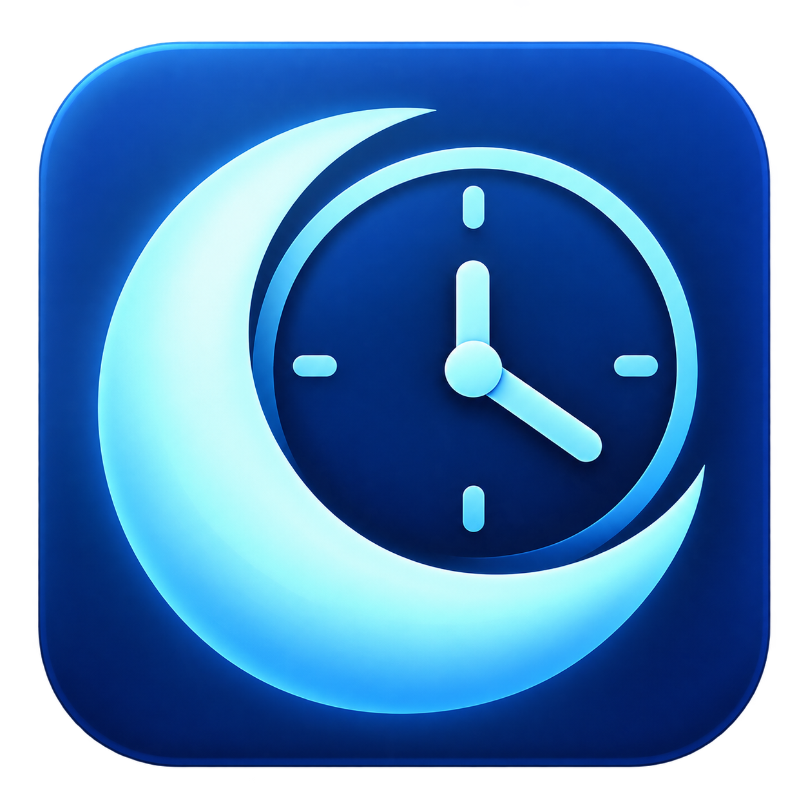

# Windows Sleep & Wake Timer



A small Windows desktop utility that schedules a wake-up task before putting your computer to sleep. Choose a delay, confirm the action, and cancel during the 10-second countdown if needed.

Built to solve a practical problem: letting a remotely accessed computer sleep for a while and making it available again later. It uses Windows Task Scheduler wake timers, without a cloud account or a separate server.

**[Download the latest release](https://github.com/iwantthesky/windows-sleep-wake-timer/releases/latest)**

## Features

- English and Turkish interfaces. Select the language during setup or on the first portable launch; change it later in the app.
- Delays from 1 to 1,440 minutes; default 15 minutes.
- Explicit confirmation and a cancelable 10-second countdown before sleep.
- AC-power, power-plan, task, and active wake-timer checks before sleeping.
- A main wake trigger plus fallback triggers at +2 and +5 minutes.
- Keep the computer awake for 10 minutes after the wake task runs.
- Optionally start a stopped Chrome Remote Desktop service, if installed.
- No-sleep software checks, a per-user setup EXE, and a single-file portable EXE with an embedded icon.

## Install

1. Download `SleepWakeTimer-Setup.exe` from [Releases](https://github.com/iwantthesky/windows-sleep-wake-timer/releases).
2. Choose **English** or **Türkçe**, then click **Install / Kur**.
3. Setup installs for the current Windows user, adds a Start menu shortcut, and optionally adds a desktop shortcut.
4. Open the app using its shortcut and approve the Windows administrator prompt.

Setup does not put the computer to sleep, restart it, or start the app automatically. The installation directory is `%LocalAppData%\Programs\WindowsSleepWakeTimer`. Reinstalling backs up an existing EXE; installation is blocked while the app has a wake task, to avoid replacing a scheduled executable.

### Portable version

Extract `SleepWakeTimer-1.1.0-win-x64.zip` and open `UykuZamanlayici.exe`. Do not run it directly inside the ZIP. Choose your language on the first launch. No additional app DLL or icon file is required.

The language selection is saved locally in `%LocalAppData%\WindowsSleepWakeTimer\language.txt`. It contains only `en` or `tr` and is not included in the downloads. The **English / Türkçe** button changes the interface without restarting the app. Language changes are disabled during the sleep countdown. Windows permission prompts and native system error details use the operating system's language.

## Use

Choose the delay, then click **Schedule wake-up and sleep / Uyandırmayı kur ve uyut** and confirm. Use **Cancel task / Görevi iptal et** during the countdown to cancel.

**Perform your first real sleep/wake test near the computer.** Remote access disconnects during sleep. Waking the hardware and reconnecting to the network are separate requirements.

## Requirements and limits

- Windows 10/11 x64 with .NET Framework 4.8.
- Administrator permission to create a SYSTEM scheduled task and request sleep.
- AC power, a working Windows Task Scheduler service, and all AC wake timers enabled in the active power plan.
- Firmware, hardware, and drivers that support waking from sleep using a Windows timer. Preflight checks for S3 support.

Automatic wake-up is hardware-dependent. Windows may wake the computer slightly before the task time. The fallback triggers use the same mechanism and cannot fix unsupported firmware.

Keep the EXE at the same location while a wake task is active. Moving or deleting it would prevent the scheduled action from running. Chrome Remote Desktop is optional; other remote-access tools must recover their own connections.

The app does not change the power plan, BIOS, router, or Chrome curtain-mode settings. It does not turn on a fully shut-down computer or implement Wake-on-LAN.

## How it works

The app creates its own `UykuZamanlayici-Uyandir` task through the Task Scheduler COM API, running as SYSTEM with `WakeToRun` and three time triggers. It rechecks AC power, the task, and `powercfg /waketimers` before requesting sleep through `SetSuspendState`.

The wake task uses `SetThreadExecutionState` to keep the computer awake for 10 minutes, then deletes its own task. A stopped Chrome Remote Desktop service can be started; a running service is not restarted.

## Privacy

There is no telemetry, cloud account, or network data-sending code. Published packages contain no personal paths, development-machine details, credentials, old logs, language preferences, or previous test records.

New logs stay locally in `%ProgramData%\UykuZamanlayici\Diagnostics`. Detailed preflight output can include Windows power-request and wake-timer information; review diagnostic files before sharing them.

## Check without sleeping

In an administrator terminal:

```bat
UykuZamanlayici.exe --diagnose --language en
UykuZamanlayici.exe --preflight --language tr
```

`--diagnose` temporarily enables and restores the sleep privilege and checks power settings. It creates no task and never calls sleep.

`--preflight` creates a temporary wake task about 25 seconds ahead, verifies the timer and real SYSTEM callback while the computer stays awake, then removes the task. It never calls sleep. The language option controls diagnostic text without changing the saved preference. Results are in `yetki-kontrolu.txt` and `on-kontrol.txt` in the diagnostics folder.

## Validation

The app and installer compile locally. Translation and preference-persistence checks, installer-payload checks, no-sleep preflight, embedded icons, package contents, and SHA-256 hashes are verified during release preparation.

An earlier development build completed two real sleep/wake cycles on one computer, followed by remote reconnection. The bilingual release is not put through another real sleep cycle during packaging. This does not guarantee the same behavior on other hardware. Neither EXE is digitally signed.

## Build

Run `build.cmd` on Windows x64 with .NET Framework 4.8. It uses the local C# compiler; no NuGet restore or download is needed. Outputs:

```text
bin\UykuZamanlayici.exe
bin\SleepWakeTimer-Setup.exe
```

The installer embeds the compiled app. `src/Program.cs` contains sleep/wake logic; `Localization.cs` and `TranslationCatalog.cs` contain language support; `Installer.cs` contains per-user setup.

## Credits and license

Code and icon developed with AI assistance. See [the icon notes](assets/ICON.md). Licensed under the [MIT License](LICENSE).
